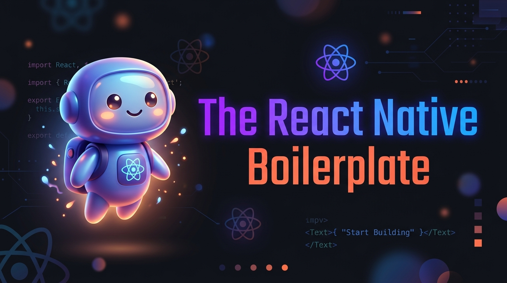

<div align="center">

  

  <br />
  <br />

  <p align="center">
    <a href="LICENSE"></a>
    <a href="https://npmjs.com/package/@bhargavp21/react-native-boilerplate"></a>
    <a href="https://npmjs.com/package/@bhargavp21/react-native-boilerplate"></a>
    <a href="https://www.typescriptlang.org/"></a>
    <a href="https://reactnative.dev/"></a>
    <a href="https://redux-toolkit.js.org/"></a>
  </p>

</div>

---

# 🚀 The React Native Boilerplate

A production-ready, enterprise-grade **React Native** & **TypeScript** boilerplate architected by **Bhargav Parmar**. Designed for building scalable, high-performance, cross-platform iOS and Android mobile applications with a clean separation of concerns.

---

## ✨ Features

- ⚡ **React Native 0.87.1** with **React 19**
- 🔷 **100% TypeScript** with strict type safety & path aliases (`@components`, `@theme`, `@screens`, `@store`, etc.)
- 🔄 **Redux Toolkit & React-Redux** with pre-configured slices, persistence, and typed hooks (`useAppDispatch`, `useAppSelector`)
- 🧭 **React Navigation v7** (Native Stack) with type-safe route configurations
- 🎨 **Dynamic Theme System** (Dark & Light mode, Color Tokens, Metrics, Typography, Shadows, Spacing)
- 🧩 **Reusable UI Components**:
  - `AppButton`, `AppInput`, `AppText`, `AppCard`, `AppLoader`
  - `KeyboardAvoidScrollView`, `ScreenWrapper`, `AppHeader`, `ModalContainer`, `Badge`, `Spacer`
- 🌐 **Axios API Client** with request/response interceptors, centralized endpoints, and token management
- 📱 **Responsive UI Helpers** (`scale`, `verticalScale`, `moderateScale`, responsive typography)
- 🛡️ **Async Storage** wrapper for seamless local persistence
- 🪝 **Custom Utility Hooks** (`useDebounce`, `useKeyboard`, `useResponsive`, `useTheme`)
- 🎬 **React Native Reanimated 4** & **Gesture Handler** pre-configured

---

## 🚀 Quick Start & Project Creation

### 1. Initialize a New Project

Run any of the following commands in your terminal to generate a new application using this boilerplate:

```bash
# Recommended: Using React Native Community CLI
npx @react-native-community/cli@latest init MyApp --template @bhargavp21/react-native-boilerplate

# Alternative: Using React Native CLI
npx react-native@latest init MyApp --template @bhargavp21/react-native-boilerplate

# Alternative: Direct from GitHub repository
npx react-native@latest init MyApp --template https://github.com/bhargavp7622/RNBoilerPlate.git
```

> **Note:** Replace `MyApp` with your desired application name.

---

## ⚙️ Installation & Setup

Navigate into your newly created project directory:

```bash
cd MyApp
```

### 1. Install Node Dependencies

```bash
# Using Yarn (Recommended)
yarn install

# Or using NPM
npm install
```

### 2. Install iOS CocoaPods *(macOS only)*

```bash
# Navigate to ios directory and install pods
cd ios && pod install && cd ..

# Or using npx pod-install
npx pod-install
```

---

## 📱 Running the Application

### Step 1: Start Metro Bundler

In your project root directory:

```bash
# Using Yarn
yarn start

# Or using NPM
npm start
```

### Step 2: Launch on iOS

```bash
# Using Yarn
yarn ios

# Or run on a specific simulator
yarn ios --simulator="iPhone 16 Pro"

# Or using NPM
npm run ios
```

### Step 3: Launch on Android

Ensure an Android emulator is running or a physical device is connected with USB Debugging enabled:

```bash
# Using Yarn
yarn android

# Or using NPM
npm run android
```

---

## 📂 Project Architecture

```
MyApp/
├── src/
│   ├── assets/             # Images, icons, and static assets
│   ├── components/         # Reusable atomic UI components
│   │   └── common/
│   │       ├── AppText/
│   │       ├── AppButton/
│   │       ├── AppInput/
│   │       ├── KeyboardAvoidScrollView/
│   │       ├── ScreenWrapper/
│   │       ├── AppHeader/
│   │       ├── AppCard/
│   │       ├── AppLoader/
│   │       ├── Spacer/
│   │       ├── Badge/
│   │       └── ModalContainer/
│   ├── constants/          # App configuration & layout constants
│   ├── hooks/              # Custom React hooks (useResponsive, useDebounce, useKeyboard)
│   ├── navigation/         # React Navigation stacks, navigators & routes
│   ├── screens/            # Application screens (HomeScreen, etc.)
│   ├── services/           # Axios API client, interceptors & endpoints
│   ├── store/              # Redux Toolkit store, slices, typed hooks
│   ├── theme/              # Color tokens, typography, metrics, shadows, ThemeContext
│   ├── types/              # Global TypeScript interfaces & declarations
│   └── utils/              # Responsive scaling, validation, formatting, storage
├── App.tsx                 # Root application wrapper with Theme & Redux providers
├── babel.config.js         # Path alias & reanimated plugin setup
├── tsconfig.json           # Path alias definitions
└── package.json            # Project dependencies & scripts
```

---

## 🛠️ Path Aliases

This boilerplate is configured with clean path aliases so you don't need messy relative imports (`../../`):

| Alias | Target Directory | Example Usage |
| :--- | :--- | :--- |
| `@components` | `src/components` | `import { AppButton, AppText } from '@components';` |
| `@theme` | `src/theme` | `import { useTheme, colors } from '@theme';` |
| `@hooks` | `src/hooks` | `import { useDebounce, useResponsive } from '@hooks';` |
| `@store` | `src/store` | `import { useAppDispatch, useAppSelector } from '@store';` |
| `@services` | `src/services` | `import { apiClient, apiEndpoints } from '@services';` |
| `@utils` | `src/utils` | `import { scale, storage } from '@utils';` |
| `@constants` | `src/constants` | `import { Config, Layout } from '@constants';` |
| `@types` | `src/types` | `import { ApiResponse, User } from '@types';` |
| `@navigation` | `src/navigation` | `import { Routes } from '@navigation';` |
| `@screens` | `src/screens` | `import { HomeScreen } from '@screens';` |

---

## 🔧 Troubleshooting

<details>
<summary><b>1. CocoaPods installation fails on iOS</b></summary>

Run the following commands:
```bash
cd ios
pod deintegrate
pod cache clean --all
pod install --repo-update
cd ..
```
</details>

<details>
<summary><b>2. Metro Bundler cache issues</b></summary>

Start Metro with a clean cache:
```bash
yarn start --reset-cache
# or
npm start -- --reset-cache
```
</details>

<details>
<summary><b>3. Android build errors / Gradle issues</b></summary>

Clean the Gradle build cache:
```bash
cd android
./gradlew clean
cd ..
yarn android
```
</details>

---

## 👨‍💻 Author & Connect

<div align="center">
  <h3>Built with ❤️ by <strong>Bhargav Parmar</strong></h3>
  <p>Mobile Application Developer | React Native Specialist</p>

  <a href="https://github.com/bhargavp7622">
    
  </a>
  &nbsp;
  <a href="https://www.linkedin.com/in/parmar-b-b0aa11202/">
    
  </a>
  &nbsp;
  <a href="https://npmjs.com/~bhargavp21">
    
  </a>

</div>

---

## 📄 License

This project is licensed under the MIT License - see the [LICENSE](LICENSE) file for details.
